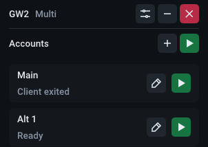
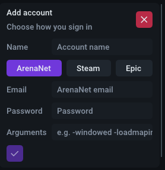
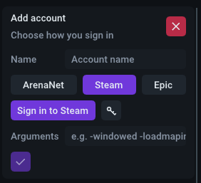
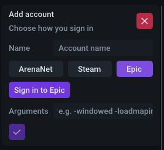
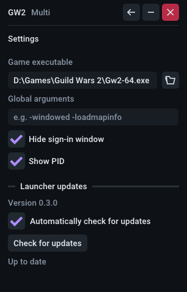

# GW2 Multi Launcher

Several Guild Wars 2 accounts. One copy of the game.

Launch one account, or all of them. Launch all starts the next account only after the previous client has finished loading, so several clients are not loading at once. Each account opens in its own window. Closing the launcher leaves the game open.

<p align="center">
  
</p>

Add an account with ArenaNet, Steam, or Epic. You sign in once, then just launch.

Drag an account's header to reorder it. Release to save the order, or press Escape
to cancel.

If GW2 asks for a verification code, the waiting account expands into view. Enter
the code from your email, SMS, or authenticator app, then press Enter or click the
checkmark. Email prompts show which inbox to check. Verification automatically
enables GW2's **Remember network** option.

<p align="center">
  
  
  
</p>

In Settings, select your installed `Gw2-64.exe`. When you launch an account, the
launcher checks for GW2 updates. If no GW2 clients are running, it installs any
required update automatically, then launches your account. If an update is needed
while GW2 is running, close all GW2 windows and launch again.

To load DLLs at startup, use the **DLLs** folder button in Settings or an account's
editor. DLLs selected in Settings load first, followed by that account's DLLs;
duplicate files load once. Click a file's tag to replace it or its cross to remove
it. Changes apply on the next launch.

Each game loads its own temporary copy of the selected DLL, keeping the original
filename so add-ons can still find it by name. You can rebuild or replace the
source DLL while playing. Copies are removed after the game exits, even if you
close the launcher first.

<p align="center">
  
</p>

## Install

- **Windows 10/11:** download the setup from [Releases](https://github.com/Dvow/gw2-multi-launcher/releases).
- **Ubuntu 26.04:** install the `.deb` from that page with `sudo apt install ./gw2-multi-launcher_*_amd64.deb`. Configure Wine or Proton under **Wine / Proton** in Settings.

Not an official ArenaNet app. Two-factor still works like a normal login.

<details>
<summary>Build</summary>

CMake 3.30+, Ninja, and the .NET 10 SDK. Windows also needs MSVC x64 and the Windows SDK.

```sh
cmake --preset release
cmake --build --preset release
```

The installer is written to `build/release`. On Windows, regular PowerShell works when the MSVC x64 and Windows SDK build environment is configured. Visual Studio's Developer PowerShell is one way to set that up; you do not need to switch terminals if your current session already builds successfully.

Windows configure downloads Inno Setup 7.1.0 into `build/tools/Inno Setup 7` when `ISCC.exe` is not already available. That folder is ignored by Git. To select another compiler, configure with `cmake --preset release -DGW2_ISCC="C:/path/to/Inno Setup/ISCC.exe"`.

On Ubuntu, install `g++ cmake ninja-build pkg-config dpkg-dev libsecret-1-dev libssl-dev libcurl4-openssl-dev libgl-dev libx11-dev libxext-dev libxcursor-dev libxrandr-dev libxi-dev libxfixes-dev libxss-dev libxtst-dev`, then configure with `-DCMAKE_INSTALL_PREFIX=/usr -DGW2_NATIVE_DIR=/path/to/matching/windows/bin`.

MIT licensed.

</details>
